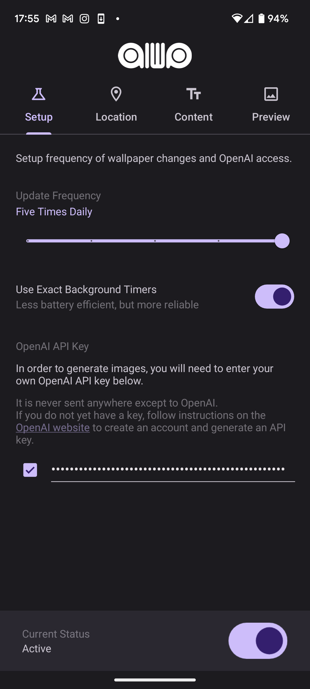
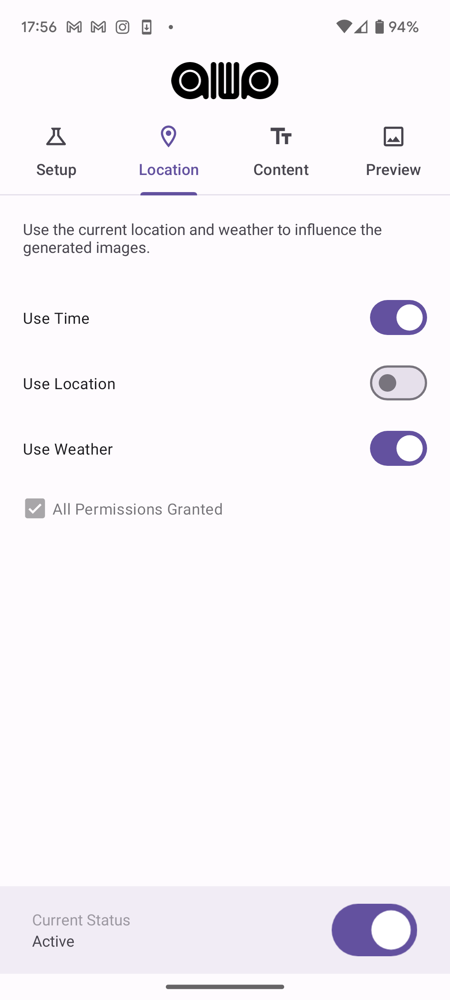

# AIWP

AI-generated, context aware wallpapers for Android.

[Available in the Play Store](https://play.google.com/store/apps/details?id=com.minosapps.aiwp)

Latest releases [here](https://github.com/minosvasilias/AIWP/releases).

### About

AIWP is a lightweight app that utilizes the OpenAI DALL·E 3 API to generate phone wallpapers in the background based on custom user prompts, with time, location and weather data injected into those prompts.

### Features

- Bring Your Own Key handling of OpenAI API keys.
- Efficient background process updating wallpapers using either [inexact or exact alarms](https://developer.android.com/training/scheduling/alarms)
- Coarse location access to inject city and country names into generation prompts
- [Open-Meteo](https://open-meteo.com/en/docs#current=temperature_2m,is_day,precipitation,rain,showers,snowfall,weather_code,cloud_cover&hourly=&forecast_days=1) API usage to inject weather information into prompts
- Clean [Material You UI](https://m3.material.io/)

### Screenshots

   

   
